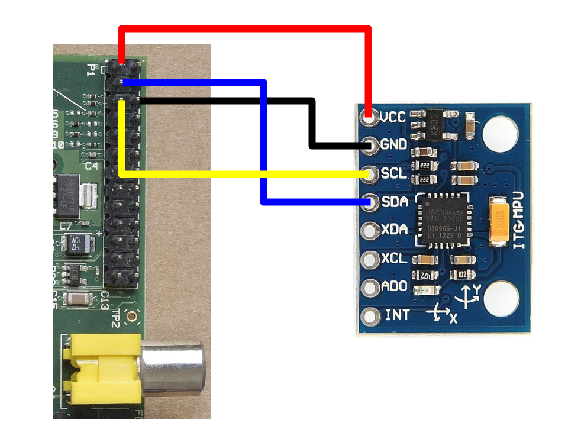

Dreamland
=========
## Accelerometer connection demos for Raspberry Pi

Code to set up an accelerometer / gyro to sense rotation in the dreamland wheel. 

### Read gyro values and calculate angle

Files:
gyrotest3.py

This code runs on the RPi connected to the MPU-6050 accelerometer/gyro chip.

The code reads angular speed data from the MPU-6050 gyros and integrates the values over time to calculate the carousel angle. The code prints the numbers to stdout every 2 seconds.

This code runs on the RPi, and communicates with the chip via i2c. 

Here's an image showing how to connect the MPU-6050 to the RPi:  

local image copy:  

Also, here (web copy):  

Some useful info links:

- A [very nice introduction](http://blog.bitify.co.uk/2013/11/interfacing-raspberry-pi-and-mpu-6050.html) on how to connect the MPU-6050 to a Raspberry Pi, with demo programs to calculate tip/tilt of the chip.
- [Extensive documentation](http://www.i2cdevlib.com/devices/mpu6050#source) of the MPU-6050 chip, with register values meanings etc
- [Docsheet](https://www.olimex.com/Products/Modules/Sensors/MOD-MPU6050/resources/RM-MPU-60xxA_rev_4.pdf) of the MPU-6050
- [How to install SMBus i2c module for Python 3](http://www.linuxcircle.com/2015/05/03/how-to-install-smbus-i2c-module-for-python-3/) - we may have to do this if we want to using python 3.